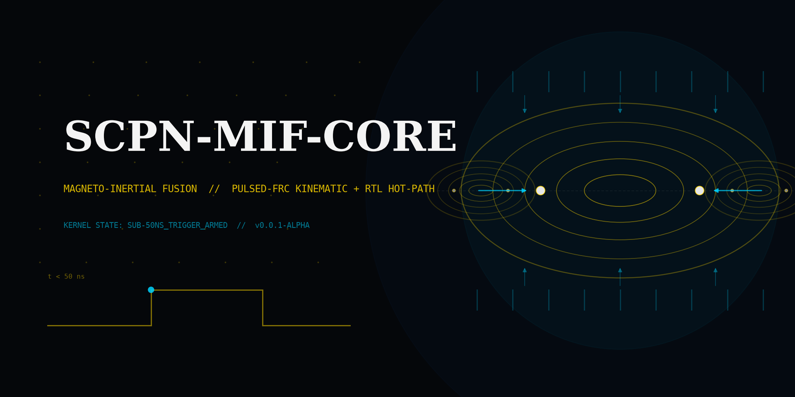

<!-- SPDX-License-Identifier: AGPL-3.0-or-later -->
<!-- Commercial license available -->
<!-- © Concepts 1996–2026 Miroslav Šotek. All rights reserved. -->
<!-- © Code 2020–2026 Miroslav Šotek. All rights reserved. -->
<!-- ORCID: 0009-0009-3560-0851 -->
<!-- Contact: www.anulum.li | protoscience@anulum.li -->

# SCPN-MIF-CORE — Magneto-Inertial Fusion Core

<p align="center">
  
</p>

[](LICENSE)
[](https://pypi.org/project/scpn-mif-core/)
[](https://pypi.org/project/scpn-mif-core/)
[](https://pepy.tech/project/scpn-mif-core)
[](https://github.com/anulum/scpn-mif-core/actions/workflows/ci.yml)
[](https://codecov.io/gh/anulum/scpn-mif-core)
[](https://github.com/anulum/scpn-mif-core/actions/workflows/codeql.yml)
[](https://github.com/anulum/scpn-mif-core/actions/workflows/docs.yml)
[](https://github.com/anulum/scpn-mif-core/actions/workflows/pre-commit.yml)
[](https://github.com/astral-sh/ruff)
[](https://mypy-lang.org/)
[](https://securityscorecards.dev/viewer/?uri=github.com/anulum/scpn-mif-core)
[](https://www.bestpractices.dev/projects/13315)
[](pyproject.toml)
[](rust-toolchain.toml)
[](Project.toml)
[](lean-toolchain)
[](go.mod)
[](#status)
[](https://doi.org/10.5281/zenodo.20768029)

Deterministic phase synchronisation and hardware synthesis for high-beta
pulsed magneto-inertial fusion plasmas on field-reversed configurations.
The engineering objective is sub-50-nanosecond combinatorial sensor-to-actuator
triggering on AMD Xilinx UltraScale+ FPGAs; the present release ships the
software kinematic, lifecycle, diagnostic, and AER surfaces that this trigger
path consumes. The trigger fabric (MIF-008) — a clocked, debounced single-shot
trigger whose `lock_now`/fire output is combinational while the fire decision
spans `LOCK_HOLD_CYCLES` consecutive locked cycles — is present in synthesisable
SystemVerilog with its core safety and liveness properties machine-checked on the
open-source flow (MIF-010). Alongside it, a genuinely registerless combinational
fast-veto lane is now present: a clock-free, stateless interlock whose zero-cycle
veto dominance is proved on the same open-source flow, so the kinematic-safety
veto suppresses a fire in the same cycle without waiting on the debounce. The two
lanes are delimited in [ADR 0008](docs/adr/0008-combinational-fast-veto-lane.md).
The timing-aware formal
proofs and the UltraScale+ timing-closure report that would establish the
sub-50-nanosecond budget on silicon remain roadmap items (see [Status](#status)),
not yet delivered capabilities.

> **Status:** pre-alpha with P1 local surfaces in progress. The current
> upstream-pending API set includes MIF-001 Doppler-Kuramoto synchronisation,
> MIF-002 moving-frame UPDE remap, MIF-003 merge-window monitoring, MIF-004
> pulsed-shot scheduling, MIF-005 capacitor-bank dynamics, MIF-006 AER
> spike-buffer decoding, MIF-007 B-dot ADC to Q8.8 spike-rate quantisation,
> MIF-009 Faraday recovery, MIF-011 kinematic safety, MIF-012 plasmoid-merger
> Petri-net control, MIF-016 diagnostic normalisation, MIF-017 sensor stress
> injection, and MIF-018 DAQ bus replay. Python and Rust are present for
> hot-path surfaces where applicable; Julia exists for MIF-001, MIF-002,
> MIF-005, MIF-009, MIF-011, MIF-016, and MIF-017; Go is present for MIF-018.
> Lean proofs cover the current safety/bookkeeping contracts for MIF-004,
> MIF-005, MIF-009, MIF-011, and MIF-012. MIF-007 has Python golden-reference,
> synthesisable SystemVerilog, Yosys, Verilator, and local regression evidence.
> MIF-008 adds the clocked, debounced single-shot trigger fabric in synthesisable
> SystemVerilog with a Verilator self-check, plus a registerless combinational
> fast-veto lane (clock-free interlock) in the same family; MIF-010 proves the
> fabric's veto-dominance, single-shot, and debounce no-underflow safety
> properties by k-induction, the fast-veto lane's zero-cycle veto dominance,
> subtractivity, and permit gating by k-induction, and witnesses reachability for
> both by bounded cover, via SymbiYosys (Yosys + z3). MIF-015 now has local
> cosimulation harnesses for the MIF-007 sensor path (ADC/Q8.8/RTL trace), the
> MIF-008 trigger fabric, and the fast-veto lane (all bit-true
> Python-versus-Verilator). MIF also detects the accepted SCPN-FUSION-CORE FRC
> contract surfaces without dispatching those FUSION-owned physics kernels
> locally. Vivado ZU3EG timing, hardware waveform equivalence, full external
> FUSION reference parity, and the P6 hardware trigger chain remain open
> hardware/tooling lanes. See
> [`docs/api/`](docs/api/index.md) for the implemented surfaces.

## Reading path

| Audience | Start here |
|---|---|
| Researcher evaluating fit | [Architecture overview](docs/architecture/index.md) |
| Engineer checking sibling readiness | [Dynamic compatibility matrix](docs/generated/compatibility_matrix.md) |
| Contributor | [CONTRIBUTING](CONTRIBUTING.md) |
| Security researcher | [SECURITY](SECURITY.md) |
| Citation | [CITATION.cff](CITATION.cff) |

## Quick start

```bash
git clone https://github.com/anulum/scpn-mif-core.git
cd scpn-mif-core
python -m venv .venv && source .venv/bin/activate
pip install -e ".[dev]"
make install-hooks   # wires preflight as the pre-push gate
make preflight       # ten-gate local quality check
```

The Rust workspace builds independently:

```bash
cd scpn-mif-rs
cargo test --workspace --all-features
cargo clippy --workspace --all-targets -- -D warnings
```

Optional tool-chains (gate the related accelerators and proofs):

```bash
julia --project=julia/SCPNMIFCore -e 'using Pkg; Pkg.instantiate()'
lake build          # Lean proof surface; uses the repo-root lakefile.lean
cd go && go test ./...
pixi install         # Mojo via Modular's pixi channel
```

## Command line

Installing the package provides the `scpn-mif` command:

```bash
scpn-mif version                      # installed package version
scpn-mif ecosystem [--json]           # sibling-repository compatibility report
scpn-mif run scenario.json [--json]   # run an FRC merge-trigger decision
```

The `run` scenario file mirrors `MergeTriggerScenario`: each nested object maps
to the matching spec (`moving_frame`, `merge_window`, `bank`, `compression_pulse`,
and the optional `recovery` + `expansion`). The same decision is available in
Python via `from scpn_mif_core import evaluate_merge_trigger`.

## Architecture in one figure

```
sensor → [AER]  ┐
                ├── SNN (Q8.8) → debounced trigger fabric → coil switch
slow control ───┘   ↑
                    └── PulsedScenarioScheduler (CONTROL Petri-net + NMPC)
                          ↑
                          ├── CapacitorBank model
                          ├── DopplerEngine + MovingFrameUPDE (PHASE-ORCH)
                          ├── Hall-MHD pulsed + MRTI + tilt (FUSION-CORE)
                          └── QAOA-MPC + PQC trigger signer (QUANTUM-CONTROL)
```

Target latency budget end to end: **≤ 50 nanoseconds** sensor edge → switch edge.
The budget is a design constraint on the trigger fabric's combinational fire
path, not a measured result; the delivered MIF-008 fabric is a clocked debounced
trigger, and meeting the end-to-end budget on silicon needs a timing-aware
property set with a timed-automata back-end and an UltraScale+ timing-closure
report, which remain roadmap items (see [Status](#status)). It is also a
decomposed budget, not a single number, and a recomputable artifact rather than a
claim: `bench/results/trigger_latency_budget.json` (regenerate with `python -m
tools.trigger_latency_budget`) breaks the path into tiers, each labelled as a
genuine cycle count or an explicit modelled assumption. Under those assumptions
the modelled B-dot ADC conversion and coil-driver tiers dominate and the hot path
is over the 50 ns target — the combinational decision tier is a single clock
period, while the analog tiers, not the logic, set the latency. The combinational decision tier is
realised today by the registerless fast-veto lane, whose zero-cycle veto
dominance is machine-checked; the debounced fabric remains the multi-cycle
safety-qualified path that the lane gates ([ADR 0008](docs/adr/0008-combinational-fast-veto-lane.md)).
The delivered hardware surface today is
the MIF-007 B-dot ADC → Q8.8 spike-rate quantiser (`hdl/src/sensors/`) and the
MIF-008 debounced trigger fabric with its registerless fast-veto lane
(`hdl/src/triggers/`), each with a Verilator cosimulation harness; the MIF-008
functional safety and liveness properties for both lanes are machine-checked by
the MIF-010 SymbiYosys suites in `hdl/formal/`.

## Sibling repositories

MIF consumes sibling repositories through a generated compatibility report,
not through hand-maintained equality pins. Regenerate it with:

```bash
python tools/generate_compatibility_matrix.py
```

| Sibling | Role | Dynamic status source |
|---|---|---|
| [`sc-neurocore-engine`](https://github.com/anulum/sc-neurocore) | SNN → SystemVerilog emitter, Q8.8 quantiser, AER HDL, SymbiYosys properties | [`docs/generated/compatibility_matrix.md`](docs/generated/compatibility_matrix.md) |
| [`scpn-phase-orchestrator`](https://github.com/anulum/scpn-phase-orchestrator) | Kuramoto family, distance coupling, monitors, Rust kernel, Lean SPO base | [`docs/generated/compatibility_matrix.md`](docs/generated/compatibility_matrix.md) |
| [`scpn-control`](https://github.com/anulum/scpn-control) | Petri-net runtime + formal verification, SNN controller, Rust hot path, replay | [`docs/generated/compatibility_matrix.md`](docs/generated/compatibility_matrix.md) |
| [`scpn-fusion-core`](https://github.com/anulum/scpn-fusion-core) | Canonical physics-solver laboratory (Hall-MHD, MRTI, tilt, equilibrium) | [`docs/generated/compatibility_matrix.md`](docs/generated/compatibility_matrix.md) |
| [`scpn-quantum-control`](https://github.com/anulum/scpn-quantum-control) | QAOA-MPC, pulse shaping, bridges, QRNG, PQC trigger signer | [`docs/generated/compatibility_matrix.md`](docs/generated/compatibility_matrix.md) |

The specific contract lanes MIF consumes, developed in the siblings under the
bidirectional sync protocol, are:

- **`scpn-fusion-core` — FUS-C.1…C.7**: FRC rigid-rotor equilibrium, two-fluid
  Hall-MHD pulsed solver, non-adiabatic flux constraint, MRTI and tilt-mode
  trackers, pulsed compression. Fusion Core owns the solver mathematics; MIF
  consumes the public contract through `scpn_mif_core.physics.fusion_frc_contract`
  without duplicating the kernels.
- **`scpn-control` — CON-C.1…C.7**: pulsed-scenario scheduler, capacitor-bank
  state model, AER control observation, replay schema, NMPC pulsed-shot adapter,
  multi-shot campaign orchestrator, PREEMPT_RT runtime binding.
- **`scpn-phase-orchestrator` — PHA-C.1…C.6**: spatial coupling modulator,
  Doppler engine, moving-frame UPDE engine, merge-window monitor, time-varying
  angular frequency, and Lean 4 kinematic safety lemmas.
- **`sc-neurocore-engine` — NEU-C.1…C.6**: UltraScale+ synthesis target,
  timing-aware formal framework, mixed-precision Q8.8/Q16.16, AER priority queue,
  ADC-to-spike quantiser HDL, and the DCLS Q8.8 RTL path.
- **`scpn-quantum-control` — QUA-C.1…C.6**: QRNG stream, PQC trigger signer,
  FRC QAOA-MPC cost, UltraScale+ HLS codegen, sub-microsecond tracker, and NV
  magnetometry. This lane is deferred for the current MIF gate.

Live readiness and version status for every lane are derived from sibling source
by the generated matrix, never from static equality pins.

## Technical specification

> The remainder of this document is the original functional specification
> that anchors the development plan. It is preserved verbatim. The
> mathematical objects below are the carrier equations referenced from
> [`docs/architecture/index.md`](docs/architecture/index.md).

### Operational target

`scpn-mif-core` solves the bottleneck in pulsed magneto-inertial fusion:
**direct energy recovery latency**.

Pulsed FRC devices have proven they can reach fusion ignition temperatures
(> 100 M °C). Creating fusion is mathematically distinct from extracting
net electricity. High-beta reactors do not boil water; they extract energy
via Faraday induction when the fusion reaction forces the plasma to expand
radially against the external 20-tesla magnetic field.

If the control architecture is reactive (operating in the > 1 µs CPU
envelope), it fails. Asymmetrical kinematic merging at Mach 1 triggers an
n = 1 tilt mode, or late compression triggers magneto-Rayleigh–Taylor
instabilities (MRTI). The plasma breaches confinement and hits the vacuum
wall before it can expand and push electromagnetic energy back into the
capacitor banks.

`scpn-mif-core` is engineered to preempt these macroscopic instabilities
*before* they compromise the energy-recovery cycle. It discards steady-state
tokamak logic entirely, isolating the `scpn-phase-orchestrator` Kuramoto
models and compiling them via `sc-neurocore` into sub-50-nanosecond, purely
combinatorial SystemVerilog triggers.

---

### Architectural payload and physics priors

The framework replaces standard Grad–Shafranov equilibria with non-adiabatic
two-fluid Hall-MHD logic and kinematic phase synchronisation.

#### 1. FRC kinematic phase synchronisation module

This module tracks the relative phase velocities of two incoming macroscopic
plasma bodies. It calculates the exact timing delta required for the
opposing formation coils to ensure the left and right FRCs enter phase-lock
precisely at the geometric centre of the compression chamber.

```python
import math


def kinematic_frc_synchronisation(
    omega_i: float,
    omega_rate_i: float,
    t_s: float,
    theta_i: float,
    theta_j: float,
    v_z_i: float,
    v_z_j: float,
    z_i: float,
    z_j: float,
    K_mag: float,
    alpha: float,
) -> float:
    """Rate of phase change for an FRC plasmoid during high-speed kinematic merging."""
    omega_i_t = omega_i + omega_rate_i * t_s
    spatial_coupling = K_mag / (1.0 + abs(z_i - z_j))
    doppler_shift = (v_z_i - v_z_j) / (abs(v_z_i) + 1e-9)
    return omega_i_t + spatial_coupling * math.sin(theta_j - theta_i - alpha) + doppler_shift
```

**Equation parameters:**

- `omega_i` — natural rotational frequency of the FRC driven by ion
  diamagnetic drift (rad s⁻¹).
- `omega_rate_i` — optional affine frequency drift (rad s⁻²); the default
  implementation uses zero drift and therefore preserves constant-frequency
  operation.
- `t_s` — non-negative simulation time used to evaluate `omega_i(t)`.
- `theta_i`, `theta_j` — instantaneous internal rotational phases of the
  left and right FRCs.
- `v_z_i`, `v_z_j` — axial velocities of the plasmoids moving toward the
  central chamber (m s⁻¹).
- `z_i`, `z_j` — spatial positions of the FRCs along the longitudinal axis
  (m).
- `K_mag` — base magnetic coupling strength during the reconnection phase.
- `alpha` — frustration parameter representing non-ideal resistive delays
  in magnetic reconnection.

#### 2. High-beta direct-energy-recovery module

This module provides the digital-twin verification for energy extraction.
It maps the rate of change of the internal plasma pressure directly to the
induced back-electromotive force on the external coil array.

```python
import math


def direct_energy_recovery_emf(
    R_s: float,
    dR_s_dt: float,
    B_ext: float,
    N_turns: float,
) -> float:
    """Back-EMF induced in the recovery coils due to radial expansion of the high-beta FRC."""
    dPhi_dt = B_ext * (2.0 * math.pi * R_s * dR_s_dt)
    return -N_turns * dPhi_dt
```

**Equation parameters:**

- `R_s` — instantaneous radius of the FRC separatrix (m).
- `dR_s_dt` — radial expansion velocity of the plasma post-fusion (m s⁻¹).
  Positive values indicate expansion against the field.
- `B_ext` — external confining magnetic field (T).
- `N_turns` — number of turns in the magnetic-pickup / recovery coil array.

---

### Hardware-synthesis target

`scpn-mif-core` acts as an intermediate-representation compiler. It takes
the differential equations above and translates them into an event-driven
spiking neural network. Through the `sc-neurocore` back end, the SNN is
synthesised into Q8.8 fixed-point SystemVerilog. The primary engineering
deliverable is a **formally verified FPGA bitstream** capable of reading
Address-Event-Representation magnetic-probe spikes and firing the
compression coils entirely within the sub-50-nanosecond hardware layer,
bypassing the CPU completely.

---

## Status

The repository is currently in **pre-alpha**. The P0 bootstrap release `0.0.1`
shipped the governance, build system, source-tree skeleton, testing
infrastructure, benchmark scaffolding, documentation site, CI/CD workflows, and
the compatibility matrix `LOCKED-skeleton` row. The current release `0.1.0` adds
the P1 upstream-pending kinematic, lifecycle, diagnostic, AER, and DAQ modules
(Python with Rust, and Julia or Go paths where applicable), the public API facade
and the end-to-end merge-trigger orchestrator with its CLI, the MIF-008 trigger
fabric and its registerless fast-veto lane with the MIF-010 SymbiYosys proofs and
MIF-015 cosimulation, and the latency-budget and Belova-parity artifacts.

`0.1.0` remains pre-alpha: the Vivado timing-closure number, live FUSION dispatch,
and the hardware trigger chain are still gated (see the items above).

### Capability inventory

<!-- capability-snapshot:start -->
<!-- SPDX-License-Identifier: AGPL-3.0-or-later -->
<!-- Generated by tools/capability_manifest.py; do not edit counts by hand. -->

### SCPN MIF Core Capability Inventory

| Surface | Current inventory |
|---|---:|
| Package version | 0.1.0 |
| Public API exports | 161 |
| Python capability source modules | 19 |
| Python capability classes | 76 |
| Rust workspace crates | 10 |
| Julia reference modules | 9 |
| Go parity sources | 2 |
| Lean 4 proof modules | 8 |
| Synthesisable HDL RTL modules | 4 |
| Capability documentation pages | 41 |
| Optional extras | 6 |
| Python test files | 76 |
| Public documentation pages | 41 |
| GitHub Actions workflows | 16 |

Evidence boundary: this snapshot is a static inventory. Performance, coverage, hardware, and scientific-fidelity claims require their own committed evidence artifacts.
<!-- capability-snapshot:end -->

The inventory above is generated by `tools/capability_manifest.py` from static
sources (no imports) and is the single source of truth for public capability
counts; a `pytest` drift gate fails CI if it falls out of sync.

## Licence

This work is licensed under the GNU Affero General Public License v3.0 or
later (AGPL-3.0-or-later). See [LICENSE](LICENSE) and [NOTICE](NOTICE.md).
Commercial licensing is available for organisations that cannot use AGPL —
contact [protoscience@anulum.li](mailto:protoscience@anulum.li).

## Citation

If you use this work, please cite it using [CITATION.cff](CITATION.cff)
metadata.
