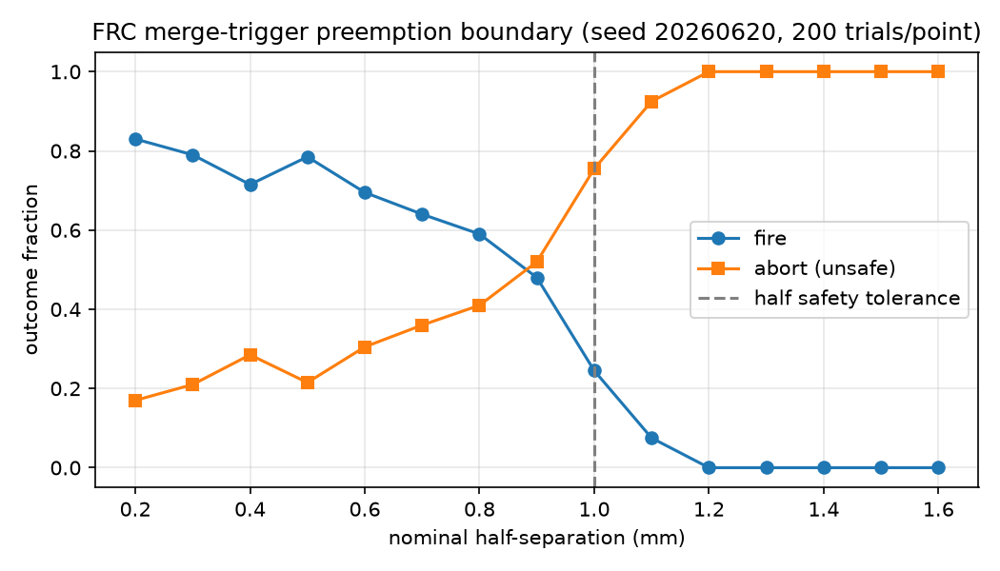

<!-- SPDX-License-Identifier: AGPL-3.0-or-later -->
<!-- Commercial license available -->
<!-- © Concepts 1996–2026 Miroslav Šotek. All rights reserved. -->
<!-- © Code 2020–2026 Miroslav Šotek. All rights reserved. -->
<!-- ORCID: 0009-0009-3560-0851 -->
<!-- Contact: www.anulum.li | protoscience@anulum.li -->
<!-- SCPN-MIF-CORE — campaigns index. -->

# Campaigns

Reproducible studies built on the public API. Each campaign commits its result
artifacts and is covered by a determinism + property test.

## Merge-trigger preemption boundary

[`merge_preemption_campaign.py`](merge_preemption_campaign.py) is a seeded
Monte-Carlo over the FRC merge-trigger decision. It sweeps the nominal
half-separation of two plasmoids and, at each point, runs many trials with
Gaussian jitter on the initial phases, positions, and velocities, recording the
outcome fractions.

The result shows the instability-preemption boundary: tight, locked approaches
fire, and once the axial separation crosses the kinematic safety envelope the
decision aborts every trial — the merge is preempted before it can drive an
`n = 1` tilt. The fire-to-abort transition sits just below the full safety
tolerance (separation = twice the half-separation), as expected.



Result data: [`results/merge_preemption.json`](results/merge_preemption.json).

Reproduce (deterministic for the committed seed):

```bash
python campaigns/merge_preemption_campaign.py
```

Scope: this is a software-level kinematic Monte-Carlo over the MIF-owned
decision, not an RTL or silicon measurement and not a self-consistent plasma
simulation. The jitter perturbs initial conditions at the kinematic layer where
the decision operates.
