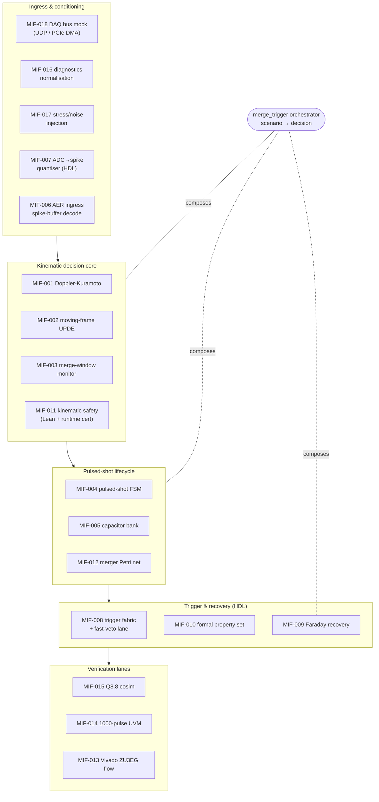
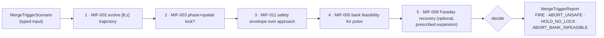

<!-- SPDX-License-Identifier: AGPL-3.0-or-later -->
<!-- Commercial license available -->
<!-- © Concepts 1996–2026 Miroslav Šotek. All rights reserved. -->
<!-- © Code 2020–2026 Miroslav Šotek. All rights reserved. -->
<!-- ORCID: 0009-0009-3560-0851 -->
<!-- Contact: www.anulum.li | protoscience@anulum.li -->
<!-- SCPN-MIF-CORE — system architecture map. -->

# SCPN-MIF-CORE — system architecture map

This is the authoritative, source-grounded map of SCPN-MIF-CORE: every component, its
inputs and outputs, its processing model, the backends that implement it and how they
are wired, and where each piece sits between *delivered* and *roadmap*. It is written
for three audiences — sibling SCPN repositories that consume MIF surfaces, the SCPN
STUDIO federation that renders MIF's capabilities, and engineers extending the core.

Counts in this document are mechanically derived from `docs/_generated/capability_manifest.json`
(an AST/file-system inventory) and `bench/dispatch.toml`; the per-component status is
grounded in the canonical specification (`docs/internal/development_plan.md`) and the
architecture decision records (`docs/adr/`). Where a capability is roadmap or
hardware-gated, this map says so — see [ADR 0005](../adr/0005-delivered-versus-roadmap-honesty.md).

## What MIF is

MIF-CORE is **the verified, deterministic, chamber-side trigger lane for pulsed
field-reversed-configuration (FRC) fusion** — a compiler from plasma kinematics to a
sub-50-nanosecond hardware compression trigger, plus the integration hub across five
sibling SCPN repositories. It is *not* a plasma-physics laboratory: the equilibrium,
transport, and self-consistent compression physics are owned by SCPN-FUSION-CORE and
consumed here as prescribed inputs ([ADR 0001](../adr/0001-repository-scope-and-ownership-boundaries.md)).

The core's value is the intersection of three things: an open-tool, machine-checked
safety/timing trigger fabric; a literature-anchored kinematic merge-window model that
consumes sibling physics as input; and a bit-true Python↔Verilator cosimulation.

### Operational targets

| Target | Bound |
|---|---|
| Sensor-to-actuator latency (worst-case fabric propagation) | < 50 ns |
| Phase-lock at chamber centre `z = 0` | `|Δθ| < 0.01 rad` |
| Spatial-lock at chamber centre | `|Δz| ≤ ±2 mm` |
| Plasmoid relative speed at merging | ≥ Mach 1 (`v_z ≥ 300 km s⁻¹`) |
| Compression peak field | 20 T |

## Inventory at a glance

| Surface | Count | Source |
|---|---:|---|
| Public API exports (facade) | 167 | `package_exports` |
| Python capability modules / classes | 20 / 78 | `python_*` |
| Rust workspace crates | 10 | `rust_workspace_crates` |
| Julia reference modules | 9 | `julia_reference_modules` |
| Mojo compiled kernels | 3 | `mojo/` |
| Go parity sources | 2 | `go_parity_sources` |
| Lean 4 proof modules | 8 | `lean_proof_modules` |
| HDL RTL modules | 4 | `hdl_rtl_modules` |
| Dispatch kernels (multi-backend) | 15 | `bench/dispatch.toml` |
| Capability documentation pages | 47 | `documentation_pages` |
| GitHub workflows | 16 | `quality_gates` |
| Optional install extras | 7 | `accelerated, demo, dev, docs, ecosystem, formal, studio` |

## Layer model

## The decision pipeline (data-flow spine)

`scpn_mif_core.merge_trigger.evaluate_merge_trigger` is the runnable end-to-end
decision that composes the MIF-owned kernels. It is the **instability-preemption
gate**: an axial-separation envelope violation aborts the shot before the merge can
drive an `n = 1` tilt, while a locked, safe, bank-feasible approach fires the trigger.

- **Input** — `MergeTriggerScenario`: the two-plasmoid kinematic state (phases,
  positions, velocities, coupling), the merge-window and safety specs, the capacitor
  bank spec + requested `PulseSpec`, and an optional prescribed `ExpansionTrajectory`.
- **Output** — `MergeTriggerReport`: the `MergeTriggerOutcome`, the moving-frame trace,
  the merge-window trace, the kinematic safety certificate, the bank feasibility, and
  the optional Faraday recovery report.
- **Ownership** — every kernel is MIF-owned; the expansion radius/field/field-rate
  channels feeding step 5 and the plasma-temperature/fusion-power telemetry the MIF-004
  FSM gates on are *prescribed inputs* owned by SCPN-FUSION-CORE (FUS-C.6), not
  evolved here.

## Component catalogue

Status legend: **SW** = delivered software (multi-backend, tested); **RTL** = delivered
synthesisable HDL with cosim; **PROOF** = delivered mechanised proof; **roadmap** = not
yet built; **HW-gated** = blocked on Vivado licence / FPGA SKU / a sibling seam.

### Lane K — Kinematic decision core (`scpn_mif_core.kinematic`)

| ID | Component | Inputs | Outputs | Processing model | Backends | Status |
|---|---|---|---|---|---|---|
| MIF-001 | Doppler-Kuramoto carrier | spec (ω, coupling K, α, ε, doppler γ), phases, positions, velocities | phase-derivative vector / RK4 trace, order parameter, phase-lock error | Swarmalator distance coupling + pair-symmetric relative-velocity Doppler term; RK4 integration | Rust · Python · Julia · **Mojo** | SW |
| MIF-002 | Moving-frame UPDE | spec, phases, positions, velocities, reference `z=0` | chamber-frame `[θ,z]` trajectory, collision-imminent flag | absolute-`z` moving-agent Kuramoto; RK45 | Rust · Python · Julia | SW |
| MIF-003 | Merge-window monitor | phases, positions, reference, tolerances (ε_θ, ε_z), streak N | per-sample lock samples, `lock_achieved`, first-lock time | combined phase-locking-value + spatial tolerance, sustained-lock streak | Rust · Python | SW |
| MIF-003+ | Merge-window feature boundary | candidate feature mapping | fail-closed validation / boundary-safe `MergeWindowFeatureVector` | enumerated lock-window feature contract for the roadmap M2 predictor ([ADR 0010](../adr/0010-merge-window-predictor-feature-boundary.md)) | Python | SW (guard); predictor roadmap |
| MIF-011 | Kinematic safety certificate | sampled axial separation / 2-D positions, safety spec (ε, contraction, disturbance) | trace certificate (passed, first-violation index, margins) | sampled envelope from the Lean MIF-011 theorem (contraction + bounded disturbance) | Rust · Python · Julia + **Lean proof** | SW + PROOF |

**Validation status (read before citing).** The **merge-window monitor and the
merge/no-merge classification are anchored to a published FRC-merge study** (Belova,
arXiv:2501.03425): the real `MergeWindowMonitor` tracks the ballistic closure and the
reconnection acceleration is explicitly delegated to SCPN-FUSION-CORE
(`tests/physics_parity/test_belova_merge_parity.py`). The **Doppler-Kuramoto phase
coupling (MIF-001) and the UPDE integrator dynamics (MIF-002) are control-lane models**,
checked for numerical self-consistency across backends (RK4 ↔ RK45) but **not** fitted
to measured FRC phase data. MIF-011's envelope is mechanically proven in Lean. Cite the
merge kinematics as literature-anchored; cite the phase coupling as a model, not
validated physics.

### Lane L — Pulsed-shot lifecycle (`scpn_mif_core.lifecycle`)

| ID | Component | Inputs | Outputs | Processing model | Backends | Status |
|---|---|---|---|---|---|---|
| MIF-004 | Pulsed-shot FSM | time, plasma state, bank state | scheduler command, state transition + JSONL audit | 8-state lifecycle (idle→ramp→flat-top→burn→expansion→dump→recharge→cool-down) with feedback guards | Rust · Python (+ Lean liveness) | SW |
| MIF-005 | Capacitor bank | bank spec (C, V_max, ESR, recharge), discharge current, `PulseSpec` | energy report, feasibility flag | RLC pulsed-discharge model; feasibility against bank state | Rust · Python · Julia | SW |
| MIF-012 | Plasmoid-merger Petri net | MIF transitions over CONTROL Petri primitives | boundedness / liveness verdicts | stochastic Petri net: collision→coalesce→lock | Rust · Python | SW |

### Lane S — Sensor ingress & conditioning (`aer`, `diagnostics`, `daq`)

| ID | Component | Inputs | Outputs | Processing model | Backends | Status |
|---|---|---|---|---|---|---|
| MIF-006 | AER ingress adapter | spike events (address, t_ns, polarity), decode spec | per-channel feature vector, ControlObservation | ring buffer + rate / temporal / ISI decode | Rust · Python · Julia · **Mojo** (rate) | SW |
| MIF-016 | Diagnostics normalisation | raw diagnostic batch/sample, calibration ranges, clip policy | normalised `[-1,1]` sample, AER features, calibration manifest | per-channel fit + bounded scaling; deterministic out-of-range fallback | Rust · Python · Julia | SW |
| MIF-017 | Stress/noise injection | sample stream, noise/jitter/dropout specs, seed | degraded sample stream, logged perturbations | seeded Gaussian noise + bounded jitter + stochastic dropout | Rust · Python · Julia | SW |
| MIF-018 | DAQ bus mock | bind addr, raw frames, replay config (UDP / PCIe ring) | replayed diagnostic samples, byte-identical consumption | deterministic transport replay with Helion/TAE descriptor profiles | Rust · Python · Go | SW |

### Lane H — Trigger, sensing HDL & recovery (`hdl/`, `physics`)

| ID | Component | Inputs | Outputs | Processing model | Backends | Status |
|---|---|---|---|---|---|---|
| MIF-007 | ADC→spike quantiser | signed ADC sample + valid, AER ready | AER address + valid | JESD-formatted ADC → Q8.8 amplitude → rate-coded spike | SystemVerilog + Python golden ref | RTL; ZU3EG synthesis HW-gated |
| MIF-008 | Trigger fabric + fast-veto lane | SNN spikes, confidence (Q8.8), safety veto | trigger pulse | clocked debounced one-shot (`mif_trigger_fabric`) **plus** a registerless zero-cycle fast-veto lane (`mif_fast_veto_gate`, [ADR 0008](../adr/0008-combinational-fast-veto-lane.md)) | SystemVerilog | RTL; sub-50 ns timing closure HW-gated |
| MIF-009 | Faraday recovery | radius, radial velocity, field, field-rate, turns, coupling, load | back-EMF, recovered power/energy, waveform | product-rule `dΦ/dt`, `EMF = -N·dΦ/dt`, trapezoidal energy | Rust · Python · Julia · **Mojo** | SW |
| MIF-010 | Timing-aware formal property set | RTL + SymbiYosys/`.sby` tasks | machine-checked safety/liveness/timing reports | k-induction over the trigger fabric + fast-veto lane; the `timing` suite proves a **bounded lock-to-resolution latency in clock cycles** via the vendored NEU-C.2 `sc_latency_monitor`; the [timing evidence package](../api/fpga/timing_evidence_package.md) keeps proof, post-route timing, and end-to-end HIL timing as separate evidence classes | SymbiYosys (open-source flow) | PARTIAL: open-tool safety + liveness + cycle-latency timing tier delivered; the ≤50 ns *wall-clock* figure and the full 70-property set need post-route STA (MIF-013, HW-gated) |

### Lane V — Verification & silicon (`cosim/`, `hdl/targets`)

| ID | Component | Inputs | Outputs | Processing model | Status |
|---|---|---|---|---|---|
| MIF-015 | Q8.8 cosimulation pipeline | Python reference, Q8.8 quantised, Verilator RTL trace | pairwise bit-equality verdict | bit-true Python ↔ Verilator across the sensor + trigger + AER-CDC RTL | SW (delivered cosim) |
| MIF-014 | 1000-pulse UVM testbench | stochastic FRC merge stimulus (jitter σ=5 ns + Pareto tail) | per-shard functional + formal pass | Verilator 5 UVM-light, 10×100-pulse shards | roadmap (MIF-008/010-gated) |
| MIF-013 | Vivado ZU3EG project + Tcl flow | RTL top-level, XDC constraints | bitstream + utilisation/timing reports | reproducible Vivado batch flow | skeleton; HW-gated (Vivado licence + FPGA SKU) |

## Polyglot backend architecture

Compute kernels follow a **fastest-measured-first dispatch chain** ([ADR 0002](../adr/0002-multi-language-acceleration-and-dispatch.md)):
the runtime selects the fastest available in-process backend per kernel; CLI surfaces
(Julia, Mojo) are measured/parity surfaces, not the in-process hot path. The ordering
is regenerated from `bench/results/` into `bench/dispatch.toml`; `scpn_mif_core._dispatch`
reads it. Python is the guaranteed floor.

| Kernel | Backend order (fastest-first) |
|---|---|
| `kinematic.doppler_kuramoto` | rust · python · mojo · julia |
| `kinematic.moving_frame_upde` | rust · python · julia |
| `kinematic.merge_window` | rust · python · julia |
| `kinematic.sampled_safety_certificate` | rust · python · julia |
| `lifecycle.pulsed_shot_fsm` | rust · python |
| `lifecycle.plasmoid_merger_petri_net` | rust · python |
| `lifecycle.capacitor_bank` | rust · python · julia |
| `aer.spike_buffer` | rust · python · julia |
| `aer.decode_rate` | rust · python · mojo · julia |
| `physics.faraday_back_emf` | rust · python |
| `physics.faraday_recovery_waveform` | python · rust · mojo · julia |
| `diagnostics.normalisation` | rust · python · julia |
| `diagnostics.stress_inject` | rust · python · julia |
| `daq.udp_multicast_mock` | rust · python · go |
| `daq.pcie_dma_ring_mock` | rust · python · go |

**Backend wiring.** Rust kernels live in 10 workspace crates (`mif-types`, `mif-core`,
`mif-kinematic`, `mif-lifecycle`, `mif-aer`, `mif-daq`, `mif-diagnostics`, `mif-fpga`,
plus `mif-ffi` for the PyO3 bridge and a fuzz crate) and are exposed to Python through
the optional `scpn_mif_core_rs` extension (`pip install scpn-mif-core[accelerated]`);
each Python subpackage's `_rust_adapter.py` narrows them. Julia surfaces
(`julia/SCPNMIFCore/`) and Mojo kernels (`mojo/`) are invoked as CLI subprocesses for
parity + measurement. Go (`go/daqmock/`) backs the DAQ transport mock. Parity across
backends is bit-exact where the maths permits and tolerance-aware (~1 ULP) where
transcendentals or fused multiply-add intervene — each is characterised in its
component's API page and parity test.

## Facade, federation & integration seams

- **Curated facade** ([ADR 0004](../adr/0004-curated-public-api-facade.md)) —
  `import scpn_mif_core` re-exports the full public surface (167 symbols); a drift gate
  (`tools/capability_manifest.py --check`) keeps the facade equal to the union of the
  subpackage `__all__`s. The `merge_trigger` orchestrator is the primary entry point.
- **STUDIO vertical** (`scpn_mif_core.studio`, optional `[studio]` extra) — makes MIF a
  federated studio on the `scpn-studio-platform` SDK: four verbs (evaluate, prove,
  cosimulate, benchmark), evidence mappers, and a capability manifest, with a
  TypeScript Module-Federation panel in `studio-web/` (federation name `scpn_mif_core`).
  See [the STUDIO vertical overview](../api/studio_vertical.md).
- **Standards interop** (`scpn_mif_core.interop`, [ADR 0009](../adr/0009-standards-interop-seams.md)) —
  `imas_mapping` maps MIF input signals onto IMAS IDS names; `trigger_io` carries White
  Rabbit timestamps, EPICS channel names, and trigger ingress/egress latency. These are
  contracts and a readiness mapping, not runtimes.
- **Ecosystem matrix** (`scpn_mif_core.ecosystem`) — introspects the sibling repos and
  renders a live compatibility matrix (versions are reported, never pinned in prose).

## Cross-repository ownership boundaries

MIF stays strictly inside its lane ([ADR 0001](../adr/0001-repository-scope-and-ownership-boundaries.md)):

| Owned by a sibling — consumed, never duplicated | Sibling |
|---|---|
| Hall-MHD / FRC equilibrium / MRTI / tilt / self-consistent compression | SCPN-FUSION-CORE |
| Petri-net runtime, NMPC, replay, neuro-symbolic controller | SCPN-CONTROL |
| SNN→Verilog, Q8.8 SNN encoder, AER router HDL | SC-NEUROCORE |
| Reusable Swarmalator / coherence-monitor primitives | SCPN-PHASE-ORCHESTRATOR |

MIF owns: FRC kinematic merging, the pulsed-shot lifecycle, the capacitor bank, the AER
sensor bridge, the sub-50 ns trigger fabric, the timing-aware formal tier, the Lean
kinematic-safety invariant, and Faraday recovery. Several kinematic surfaces are
`SYNC-STATE: upstream-pending` — implemented locally until the reusable surface lands in
the owning sibling.

## How to consume this map

- **Sibling repos** — read the ownership table and the dispatch chain before adding a
  surface that overlaps MIF; consume MIF through the facade and the `interop` contracts,
  not deep imports.
- **STUDIO** — the verb/evidence/manifest surface in `scpn_mif_core.studio` plus this
  map's component catalogue are the source for what MIF advertises to the Hub.
- **Engineers** — the decision pipeline is the spine; new capability extends an existing
  lane's subpackage and registers its kernel in `bench/dispatch.toml`.
